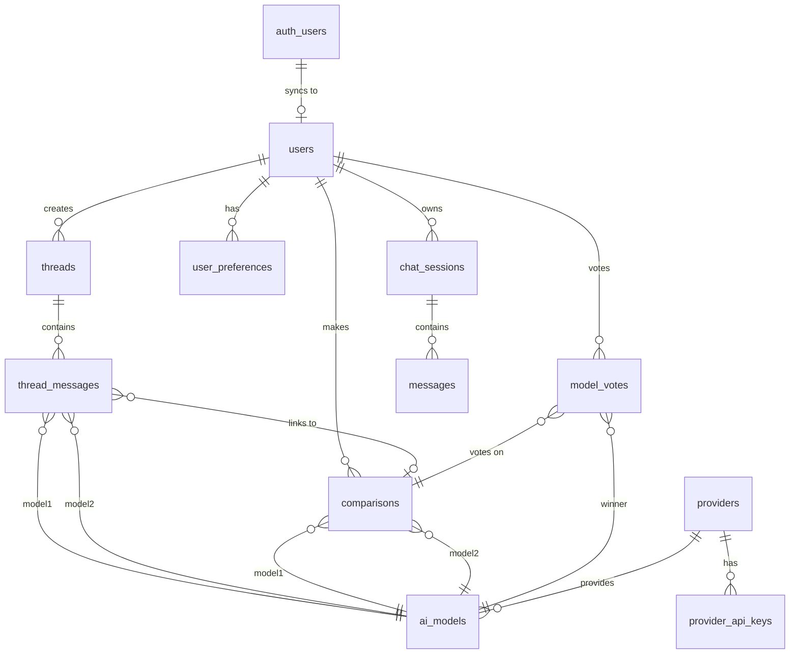

# DualMind API Reference v2.0.0

> **🤖 AI-Optimized Documentation**  
> This documentation is designed for AI coding agents (Lovable, Cursor, Copilot), frontend developers, and autonomous systems.

**Production URL:** `https://api.dualmind.ai`  
**Local Development:** `http://localhost:5000`  
**Swagger UI:** `/swagger`

---

## Table of Contents

1. [Authentication](#authentication)
2. [Response Format](#response-format)
3. [Core Endpoints](#core-endpoints)
   - [Arena (Chat AI)](#1-arena---ai-chat)
   - [Threads](#2-threads---conversation-management)
   - [Models](#3-models---ai-model-listing)
   - [Votes](#4-votes---model-voting)
   - [Speech](#5-speech---text-to-speech)
   - [Users](#6-users---user-management)
   - [Health](#7-health---api-status)
4. [Admin Endpoints](#admin-endpoints)
5. [TypeScript Types](#typescript-types)
6. [Integration Examples](#integration-examples)
7. [Error Handling](#error-handling)
8. [Streaming Guide](#streaming-guide)

---

## Authentication

All protected endpoints require a Supabase JWT token.

```http
Authorization: Bearer <SUPABASE_JWT_TOKEN>
Content-Type: application/json
```

### Getting a Token

```typescript
// Using Supabase Client
import { createClient } from '@supabase/supabase-js';

const supabase = createClient(SUPABASE_URL, SUPABASE_ANON_KEY);

// After login
const { data: { session } } = await supabase.auth.getSession();
const token = session?.access_token;

// Use in API calls
const response = await fetch(`${API_BASE_URL}/api/arena/chat`, {
  method: 'POST',
  headers: {
    'Authorization': `Bearer ${token}`,
    'Content-Type': 'application/json'
  },
  body: JSON.stringify({ prompt: 'Hello' })
});
```

---

## Response Format

### ✅ Success Response (AI Chat)

```json
{
  "object": "ai.response",
  "output": {
    "type": "message",
    "content": [
      { "type": "output_text", "text": "Hello! How can I help you?" }
    ]
  },
  "success": true,
  "message": "Hello! How can I help you?",
  "model": {
    "name": "llama-3.3-70b-versatile",
    "displayName": "Llama 3.3 70B",
    "provider": "groq"
  },
  "usage": {
    "promptTokens": 10,
    "completionTokens": 8,
    "totalTokens": 18
  },
  "responseTimeMs": 450,
  "timestamp": "2026-01-21T00:00:00Z"
}
```

> **⚠️ AI Agent Rule:** Always read AI text from `output.content[].text`. The `message` field is a convenience shortcut.

### ❌ Error Response

```json
{
  "object": "ai.error",
  "code": "INVALID_REQUEST",
  "message": "Prompt is required and cannot be empty",
  "timestamp": "2026-01-21T00:00:00Z"
}
```

---

## Core Endpoints

---

### 1. Arena - AI Chat

The Arena provides AI chat capabilities with single model, dual model comparison, and streaming.

---

#### 1.1 Single Chat (Non-Streaming)

Chat with a single AI model.

```http
POST /api/arena/chat
Authorization: Bearer <token>
```

**Request Body:**

| Field | Type | Required | Description |
|-------|------|----------|-------------|
| `prompt` | string | ✅ Yes | The user's message |
| `model` | string | No | Model name or `"auto"` for random selection |
| `system` | string | No | System prompt for context |
| `thread_id` | string (UUID) | No | Thread ID to save message to |
| `max_tokens` | number | No | Maximum response tokens |
| `temperature` | number | No | Temperature (0.0 - 2.0) |

**Request Example:**

```json
{
  "prompt": "Explain quantum computing in simple terms",
  "model": "auto",
  "system": "You are a helpful assistant",
  "max_tokens": 1024
}
```

**Response:** `ChatResponse` (see [TypeScript Types](#typescript-types))

---

#### 1.2 Dual Chat (Side-by-Side Comparison)

Compare responses from two AI models.

```http
POST /api/arena/dualchat
Authorization: Bearer <token>
```

**Request Body:**

| Field | Type | Required | Description |
|-------|------|----------|-------------|
| `prompt` | string | ✅ Yes | The user's message |
| `model1` | string | No | First model name (for manual selection) |
| `model2` | string | No | Second model name (for manual selection) |
| `selection_mode` | string | No | `"random"` (default) or `"topper"` (top-ranked model + random) |
| `system` | string | No | System prompt for both models |
| `thread_id` | string (UUID) | No | Thread ID to save messages to |
| `max_tokens` | number | No | Maximum response tokens |
| `temperature` | number | No | Temperature (0.0 - 2.0) |

**Request Example (Random Selection):**

```json
{
  "prompt": "What is the meaning of life?",
  "selection_mode": "random"
}
```

**Request Example (Manual Selection):**

```json
{
  "prompt": "What is the meaning of life?",
  "model1": "llama-3.3-70b-versatile",
  "model2": "mixtral-8x7b-32768"
}
```

**Response:**

```json
{
  "success": true,
  "agent1": { ...ChatResponse },
  "agent2": { ...ChatResponse },
  "comparisonId": "uuid-here",
  "arena": {
    "comparison": {
      "winnerByLength": "agent1",
      "winnerByTokens": "agent2",
      "verdict": "Agents traded wins on length vs. tokens; review both answers manually.",
      "userWinner": null,
      "agent1MessageLength": 500,
      "agent2MessageLength": 450,
      "agent1Tokens": 120,
      "agent2Tokens": 150
    },
    "models": {
      "agent1": "llama-3.3-70b-versatile",
      "agent2": "mixtral-8x7b-32768"
    }
  },
  "timestamp": "2026-01-21T00:00:00Z",
  "totalResponseTimeMs": 1200
}
```

---

#### 1.3 Stream Chat (Real-time SSE)

Stream chat responses in real-time using Server-Sent Events.

```http
POST /api/arena/chat/stream
Authorization: Bearer <token>
Accept: text/event-stream
```

**Request Body:** Same as Single Chat

**Stream Events:**

```
data: {"object":"ai.stream.delta","delta":{"type":"output_text","text":"Hello "}}

data: {"object":"ai.stream.delta","delta":{"type":"output_text","text":"there!"}}

data: {"object":"ai.stream.done","finish_reason":"stop","usage":{"totalTokens":18}}
```

**JavaScript Example:**

```javascript
const response = await fetch('/api/arena/chat/stream', {
  method: 'POST',
  headers: {
    'Authorization': `Bearer ${token}`,
    'Content-Type': 'application/json',
    'Accept': 'text/event-stream'
  },
  body: JSON.stringify({ prompt: 'Hello' })
});

const reader = response.body.getReader();
const decoder = new TextDecoder();

while (true) {
  const { done, value } = await reader.read();
  if (done) break;
  
  const chunk = decoder.decode(value);
  const lines = chunk.split('\n');
  
  for (const line of lines) {
    if (line.startsWith('data: ')) {
      const json = JSON.parse(line.slice(6));
      
      if (json.object === 'ai.stream.delta') {
        console.log(json.delta.text); // Append to UI
      } else if (json.object === 'ai.stream.done') {
        console.log('Stream complete');
      } else if (json.object === 'ai.error') {
        console.error(json.message);
      }
    }
  }
}
```

---

#### 1.4 Test Endpoint

Test API connectivity (requires auth).

```http
GET /api/arena/test
Authorization: Bearer <token>
```

**Response:**

```json
{
  "success": true,
  "status": "API running",
  "timestamp": "2026-01-21T00:00:00Z",
  "endpoints": {
    "chat": { "method": "POST", "path": "/api/arena/chat" },
    "dualchat": { "method": "POST", "path": "/api/arena/dualchat" }
  }
}
```

---

#### 1.5 Ping (No Auth)

Simple ping for health checks.

```http
GET /api/arena/ping
```

**Response:**

```json
{
  "success": true,
  "message": "DualMind API is running",
  "timestamp": "2026-01-21T00:00:00Z",
  "version": "1.0.0"
}
```

---

### 2. Threads - Conversation Management

Manage conversation threads for persistent chat history.

---

#### 2.1 Get User Threads

```http
GET /api/threads?limit=20
Authorization: Bearer <token>
```

**Query Parameters:**

| Param | Type | Default | Description |
|-------|------|---------|-------------|
| `limit` | number | 20 | Maximum threads to return |

**Response:**

```json
{
  "items": [
    {
      "thread_id": "uuid-here",
      "user_id": "uuid-here",
      "title": "Chat about AI",
      "created_at": "2026-01-20T00:00:00Z"
    }
  ]
}
```

---

#### 2.2 Create Thread

```http
POST /api/threads
Authorization: Bearer <token>
```

**Request Body:**

```json
{
  "title": "New Chat Thread"
}
```

**Response:**

```json
{
  "thread_id": "uuid-here",
  "user_id": "uuid-here",
  "title": "New Chat Thread",
  "created_at": "2026-01-21T00:00:00Z"
}
```

---

#### 2.3 Get Thread

```http
GET /api/threads/{threadId}
Authorization: Bearer <token>
```

**Response:**

```json
{
  "thread_id": "uuid-here",
  "user_id": "uuid-here",
  "title": "Chat about AI",
  "created_at": "2026-01-20T00:00:00Z"
}
```

---

#### 2.4 Get Thread Messages

```http
GET /api/threads/{threadId}/messages
Authorization: Bearer <token>
```

**Response:**

```json
{
  "items": [
    {
      "message_id": "uuid-here",
      "thread_id": "uuid-here",
      "prompt_text": "What is AI?",
      "model1_id": "uuid-here",
      "model2_id": "uuid-here",
      "model1_response": "AI is...",
      "model2_response": "Artificial Intelligence...",
      "model1_time_ms": 450,
      "model2_time_ms": 520,
      "created_at": "2026-01-21T00:00:00Z"
    }
  ]
}
```

---

#### 2.5 Update Thread

```http
PATCH /api/threads/{threadId}
Authorization: Bearer <token>
```

**Request Body:**

```json
{
  "title": "Updated Title"
}
```

**Response:**

```json
{
  "success": true,
  "message": "Thread updated successfully"
}
```

---

#### 2.6 Delete Thread

```http
DELETE /api/threads/{threadId}
Authorization: Bearer <token>
```

**Response:**

```json
{
  "success": true,
  "message": "Thread deleted successfully"
}
```

---

### 3. Models - AI Model Listing

Get available AI models.

```http
GET /api/models
Authorization: Bearer <token>
```

**Response:**

```json
{
  "items": [
    {
      "modelId": "uuid-here",
      "modelName": "llama-3.3-70b-versatile",
      "displayName": "Llama 3.3 70B",
      "providerName": "groq",
      "apiUrl": "https://api.groq.com/openai/v1/chat/completions",
      "status": "active"
    },
    {
      "modelId": "uuid-here",
      "modelName": "mixtral-8x7b-32768",
      "displayName": "Mixtral 8x7B",
      "providerName": "groq",
      "apiUrl": "https://api.groq.com/openai/v1/chat/completions",
      "status": "active"
    }
  ]
}
```

---

### 4. Votes - Model Voting

Submit votes for model comparisons (supports leaderboard).

---

#### 4.1 Submit Vote

```http
POST /api/arena/model-vote
Authorization: Bearer <token>
```

**Request Body:**

| Field | Type | Required | Description |
|-------|------|----------|-------------|
| `comparisonId` | string (UUID) | ✅ Yes | The comparison ID from dualchat response |
| `voteChoice` | string | ✅ Yes | `"left"`, `"right"`, `"tie"`, or `"both-bad"` |
| `userId` | string (UUID) | No | User ID (auto-detected from token) |

**Request Example:**

```json
{
  "comparisonId": "uuid-from-dualchat",
  "voteChoice": "left"
}
```

**Response:**

```json
{
  "success": true,
  "message": "Vote recorded successfully"
}
```

---

#### 4.2 Get Model Stats (Leaderboard)

```http
GET /api/arena/model-stats
Authorization: Bearer <token>
```

**Response:**

```json
{
  "items": [
    {
      "model_id": "uuid-here",
      "model_name": "llama-3.3-70b-versatile",
      "provider": "groq",
      "wins": 150,
      "times_compared": 300,
      "win_rate": 50.0
    }
  ]
}
```

---

### 5. Speech - Text-to-Speech

Generate speech audio from text.

```http
POST /api/speech/generate
```

**Request Body:**

| Field | Type | Required | Description |
|-------|------|----------|-------------|
| `text` | string | ✅ Yes | Text to convert to speech |
| `voice` | string | No | Voice name (default: `"Celeste-PlayAI"`) |

**Request Example:**

```json
{
  "text": "Hello, this is DualMind speaking.",
  "voice": "Celeste-PlayAI"
}
```

**Response:** Binary WAV audio file (`Content-Type: audio/wav`)

---

### 6. Users - User Management

Sync user data between Supabase Auth and application database.

```http
POST /api/users/sync
```

**Request Body:**

```json
{
  "id": "uuid-from-supabase-auth",
  "email": "user@example.com",
  "name": "John Doe",
  "phone": "+1234567890",
  "avatarUrl": "https://example.com/avatar.jpg",
  "provider": "google"
}
```

**Response:**

```json
{
  "id": "uuid-here",
  "email": "user@example.com",
  "synced": true
}
```

---

### 7. Health - API Status

Check API health status.

---

#### 7.1 Root Health

```http
GET /health
```

---

#### 7.2 API Health

```http
GET /api/health
```

---

#### 7.3 Ping

```http
GET /api/ping
```

---

#### 7.4 Ping Health

```http
GET /api/ping/health
```

**Response (all):**

```json
{
  "status": "healthy",
  "message": "DualMind API is running",
  "timestamp": "2026-01-21T00:00:00Z",
  "version": "1.0.0"
}
```

---

## Admin Endpoints

> **⚠️ Admin Authentication Required**  
> All admin endpoints require a valid JWT token with admin role.

**Base URL:** `/api/admin`

---

### Admin Dashboard

| Method | Endpoint | Description |
|--------|----------|-------------|
| `GET` | `/api/admin/dashboard/stats` | Overall statistics |
| `GET` | `/api/admin/dashboard/provider-stats` | Provider statistics |
| `GET` | `/api/admin/dashboard/recent-activity?limit=10` | Recent activity |
| `GET` | `/api/admin/dashboard/model-performance` | Model performance |
| `GET` | `/api/admin/dashboard/user-stats` | User statistics |
| `GET` | `/api/admin/dashboard/health` | Admin health check |

---

### Admin Providers

| Method | Endpoint | Description |
|--------|----------|-------------|
| `GET` | `/api/admin/providers` | List all providers |
| `POST` | `/api/admin/providers` | Create provider |
| `PUT` | `/api/admin/providers/{name}` | Update provider |
| `GET` | `/api/admin/providers/{name}/keys` | Get provider keys |
| `POST` | `/api/admin/providers/{name}/keys` | Add key |
| `PUT` | `/api/admin/keys/{id}/status` | Update key status |
| `DELETE` | `/api/admin/keys/{id}` | Delete key |

---

### Admin Users

| Method | Endpoint | Description |
|--------|----------|-------------|
| `GET` | `/api/admin/users?page=1&limit=200` | List users |
| `GET` | `/api/admin/users/{id}` | Get user |
| `POST` | `/api/admin/users` | Create user |
| `PUT` | `/api/admin/users/{id}` | Update user |
| `DELETE` | `/api/admin/users/{id}` | Delete user |
| `GET` | `/api/admin/users/search?email=...&role=...` | Search users |
| `PUT` | `/api/admin/users/{id}/role` | Update role |

---

### Admin Models

| Method | Endpoint | Description |
|--------|----------|-------------|
| `GET` | `/api/admin/models?page=1&limit=200` | List models |
| `GET` | `/api/admin/models/{id}` | Get model |
| `POST` | `/api/admin/models` | Create model |
| `PUT` | `/api/admin/models/{id}` | Update model |
| `DELETE` | `/api/admin/models/{id}` | Delete model |
| `GET` | `/api/admin/models/search?name=...` | Search models |
| `PUT` | `/api/admin/models/{id}/status` | Update status |
| `GET` | `/api/admin/models/active` | Get active models |

---

### Admin Comparisons

| Method | Endpoint | Description |
|--------|----------|-------------|
| `GET` | `/api/admin/comparisons?page=1&limit=50` | List comparisons |
| `GET` | `/api/admin/comparisons/{id}` | Get comparison |
| `GET` | `/api/admin/comparisons/user/{userId}` | By user |
| `GET` | `/api/admin/comparisons/model/{modelId}` | By model |
| `DELETE` | `/api/admin/comparisons/{id}` | Delete |
| `DELETE` | `/api/admin/comparisons/user/{userId}` | Delete by user |
| `GET` | `/api/admin/comparisons/search?prompt=...` | Search |
| `GET` | `/api/admin/comparisons/recent?hours=24` | Recent |

---

### Admin Votes

| Method | Endpoint | Description |
|--------|----------|-------------|
| `GET` | `/api/admin/votes?page=1&limit=50` | List votes |
| `GET` | `/api/admin/votes/{id}` | Get vote |
| `GET` | `/api/admin/votes/user/{userId}` | By user |
| `GET` | `/api/admin/votes/model/{modelId}` | By model |
| `GET` | `/api/admin/votes/comparison/{comparisonId}` | By comparison |
| `POST` | `/api/admin/votes` | Create vote |
| `DELETE` | `/api/admin/votes/{id}` | Delete vote |
| `DELETE` | `/api/admin/votes/user/{userId}` | Delete by user |
| `GET` | `/api/admin/votes/stats` | Vote statistics |

---

### Admin Threads

| Method | Endpoint | Description |
|--------|----------|-------------|
| `GET` | `/api/admin/threads?page=1&limit=50` | List threads |
| `GET` | `/api/admin/threads/{id}` | Get thread |
| `GET` | `/api/admin/threads/user/{userId}` | By user |
| `POST` | `/api/admin/threads` | Create thread |
| `PUT` | `/api/admin/threads/{id}` | Update thread |
| `DELETE` | `/api/admin/threads/{id}` | Delete thread |
| `DELETE` | `/api/admin/threads/user/{userId}` | Delete by user |
| `GET` | `/api/admin/threads/search?title=...` | Search |

---

### Admin Messages

| Method | Endpoint | Description |
|--------|----------|-------------|
| `GET` | `/api/admin/messages?page=1&limit=50` | List messages |
| `GET` | `/api/admin/messages/{id}` | Get message |
| `GET` | `/api/admin/messages/thread/{threadId}` | By thread |
| `POST` | `/api/admin/messages` | Create message |
| `DELETE` | `/api/admin/messages/{id}` | Delete message |
| `DELETE` | `/api/admin/messages/thread/{threadId}` | Delete by thread |
| `GET` | `/api/admin/messages/search?prompt=...` | Search |

---

## TypeScript Types

Copy these types for full type-safety in your frontend:

```typescript
// ============================================
// DualMind API Types
// ============================================

// --- Request Types ---

export interface ChatRequest {
  prompt: string;
  model?: string;        // Model name or "auto"
  model1?: string;       // For dualchat manual selection
  model2?: string;       // For dualchat manual selection
  selectionMode?: 'random' | 'topper';
  system?: string;
  threadId?: string;     // UUID
  maxTokens?: number;
  temperature?: number;  // 0.0 - 2.0
}

export interface VoteRequest {
  comparisonId: string;  // UUID
  voteChoice: 'left' | 'right' | 'tie' | 'both-bad';
  userId?: string;       // UUID (optional, from token)
}

export interface CreateThreadRequest {
  title?: string;
}

export interface UpdateThreadRequest {
  title: string;
}

export interface SyncUserRequest {
  id: string;
  email: string;
  name?: string;
  phone?: string;
  avatarUrl?: string;
  provider?: string;
}

export interface SpeechRequest {
  text: string;
  voice?: string;
}

// --- Response Types ---

export interface ContentPart {
  type: 'output_text';
  text: string;
}

export interface ContentOutput {
  type: 'message';
  content: ContentPart[];
}

export interface ModelInfo {
  name: string;
  displayName: string;
  provider: string;
}

export interface UsageInfo {
  promptTokens: number;
  completionTokens: number;
  totalTokens: number;
}

export interface ChatResponse {
  object: 'ai.response';
  output: ContentOutput;
  success: boolean;
  message: string;
  model: ModelInfo;
  prompt: string;
  selectionMode: string;
  responseTimeMs: number;
  usage: UsageInfo;
  timestamp: string;
}

export interface DualChatResponse {
  success: boolean;
  agent1: ChatResponse;
  agent2: ChatResponse;
  comparisonId: string;
  arena: {
    comparison: {
      winnerByLength: 'agent1' | 'agent2' | 'tie';
      winnerByTokens: 'agent1' | 'agent2' | 'tie';
      verdict: string;
      userWinner: string | null;
      agent1MessageLength: number;
      agent2MessageLength: number;
      agent1Tokens: number;
      agent2Tokens: number;
    };
    models: {
      agent1: string;
      agent2: string;
    };
  };
  timestamp: string;
  totalResponseTimeMs: number;
}

export interface AIError {
  object: 'ai.error';
  code: string;
  message: string;
  timestamp: string;
}

export interface Thread {
  thread_id: string;
  user_id: string;
  title: string;
  created_at: string;
}

export interface ThreadMessage {
  message_id: string;
  thread_id: string;
  prompt_text: string;
  model1_id?: string;
  model2_id?: string;
  model1_response?: string;
  model2_response?: string;
  model1_time_ms?: number;
  model2_time_ms?: number;
  created_at: string;
}

export interface AIModelItem {
  modelId: string;
  modelName: string;
  displayName: string;
  providerName: string;
  apiUrl: string;
  status: 'active' | 'inactive';
}

export interface ModelStats {
  model_id: string;
  model_name: string;
  provider: string;
  wins: number;
  times_compared: number;
  win_rate: number;
}

// --- Stream Types ---

export interface StreamDelta {
  object: 'ai.stream.delta';
  delta: {
    type: 'output_text';
    text: string;
  };
}

export interface StreamDone {
  object: 'ai.stream.done';
  finish_reason: string;
  usage: {
    totalTokens: number;
  };
}

export type StreamEvent = StreamDelta | StreamDone | AIError;

// --- List Responses ---

export interface ListResponse<T> {
  items: T[];
}

export interface PaginatedResponse<T> {
  success: boolean;
  data: T[];
  count: number;
  total: number;
  page: number;
  limit: number;
}

export interface SuccessResponse {
  success: boolean;
  message: string;
}
```

---

## Integration Examples

### React Hook for Chat

```typescript
import { useState, useCallback } from 'react';

const API_BASE = process.env.NEXT_PUBLIC_API_URL || 'http://localhost:5000';

export function useChat(token: string) {
  const [loading, setLoading] = useState(false);
  const [error, setError] = useState<string | null>(null);

  const sendMessage = useCallback(async (prompt: string, threadId?: string) => {
    setLoading(true);
    setError(null);

    try {
      const response = await fetch(`${API_BASE}/api/arena/chat`, {
        method: 'POST',
        headers: {
          'Authorization': `Bearer ${token}`,
          'Content-Type': 'application/json',
        },
        body: JSON.stringify({
          prompt,
          model: 'auto',
          thread_id: threadId,
        }),
      });

      const data = await response.json();

      if (data.object === 'ai.error') {
        throw new Error(data.message);
      }

      return data as ChatResponse;
    } catch (err) {
      const message = err instanceof Error ? err.message : 'Unknown error';
      setError(message);
      throw err;
    } finally {
      setLoading(false);
    }
  }, [token]);

  return { sendMessage, loading, error };
}
```

### Streaming Chat Hook

```typescript
import { useState, useCallback, useRef } from 'react';

export function useStreamChat(token: string) {
  const [streaming, setStreaming] = useState(false);
  const [content, setContent] = useState('');
  const abortRef = useRef<AbortController | null>(null);

  const stream = useCallback(async (
    prompt: string,
    onDelta?: (text: string) => void
  ) => {
    abortRef.current = new AbortController();
    setStreaming(true);
    setContent('');

    try {
      const response = await fetch(`${API_BASE}/api/arena/chat/stream`, {
        method: 'POST',
        headers: {
          'Authorization': `Bearer ${token}`,
          'Content-Type': 'application/json',
          'Accept': 'text/event-stream',
        },
        body: JSON.stringify({ prompt }),
        signal: abortRef.current.signal,
      });

      const reader = response.body!.getReader();
      const decoder = new TextDecoder();
      let accumulated = '';

      while (true) {
        const { done, value } = await reader.read();
        if (done) break;

        const chunk = decoder.decode(value);
        const lines = chunk.split('\n');

        for (const line of lines) {
          if (line.startsWith('data: ')) {
            try {
              const json = JSON.parse(line.slice(6));

              if (json.object === 'ai.stream.delta') {
                accumulated += json.delta.text;
                setContent(accumulated);
                onDelta?.(json.delta.text);
              } else if (json.object === 'ai.stream.done') {
                // Stream complete
              } else if (json.object === 'ai.error') {
                throw new Error(json.message);
              }
            } catch (e) {
              // Skip malformed JSON
            }
          }
        }
      }

      return accumulated;
    } finally {
      setStreaming(false);
    }
  }, [token]);

  const abort = useCallback(() => {
    abortRef.current?.abort();
  }, []);

  return { stream, streaming, content, abort };
}
```

### Dual Chat Comparison

```typescript
async function compareMockModels(prompt: string, token: string) {
  const response = await fetch(`${API_BASE}/api/arena/dualchat`, {
    method: 'POST',
    headers: {
      'Authorization': `Bearer ${token}`,
      'Content-Type': 'application/json',
    },
    body: JSON.stringify({
      prompt,
      selection_mode: 'random',
    }),
  });

  const data: DualChatResponse = await response.json();

  // Display both responses
  console.log('Model A:', data.agent1.model.displayName);
  console.log('Response A:', data.agent1.message);
  
  console.log('Model B:', data.agent2.model.displayName);
  console.log('Response B:', data.agent2.message);

  // User votes
  const voteChoice = window.confirm('Did Model A win?') ? 'left' : 'right';
  
  await fetch(`${API_BASE}/api/arena/model-vote`, {
    method: 'POST',
    headers: {
      'Authorization': `Bearer ${token}`,
      'Content-Type': 'application/json',
    },
    body: JSON.stringify({
      comparisonId: data.comparisonId,
      voteChoice,
    }),
  });
}
```

---

## Error Handling

### Error Codes

| Code | HTTP Status | Description |
|------|-------------|-------------|
| `INVALID_REQUEST` | 400 | Missing or invalid request parameters |
| `UNAUTHORIZED` | 401 | Missing or invalid JWT token |
| `FORBIDDEN` | 403 | Insufficient permissions |
| `NOT_FOUND` | 404 | Resource not found |
| `PROVIDER_TIMEOUT` | 500 | AI provider timed out |
| `API_ERROR` | 500 | Internal server error |
| `STREAM_ERROR` | 500 | Streaming connection error |
| `VOTE_ERROR` | 500 | Vote recording failed |
| `THREADS_ERROR` | 500 | Thread operation failed |
| `MODELS_ERROR` | 500 | Models fetch failed |

### Error Handling Pattern

```typescript
async function apiCall<T>(
  url: string,
  options: RequestInit
): Promise<T> {
  const response = await fetch(url, options);
  const data = await response.json();

  if (data.object === 'ai.error') {
    throw new APIError(data.code, data.message);
  }

  if (!response.ok) {
    throw new APIError(
      data.code || 'UNKNOWN_ERROR',
      data.message || data.error || 'Request failed'
    );
  }

  return data;
}

class APIError extends Error {
  constructor(
    public code: string,
    message: string
  ) {
    super(message);
    this.name = 'APIError';
  }
}
```

---

## Streaming Guide

### SSE Protocol Rules

1. **Protocol:** POST-based Server-Sent Events
2. **Transport:** Use `fetch()` + `ReadableStream` (NOT `EventSource`)
3. **Line Format:** `data: <JSON>\n\n`

### Stream Events

| Event | Description |
|-------|-------------|
| `ai.stream.delta` | Text chunk received |
| `ai.stream.done` | Stream complete |
| `ai.error` | Error occurred |

### AI Agent Rules for Streaming

```
SYSTEM RULES FOR AI AGENTS:
- Parse SSE lines starting with "data: "
- Accumulate delta.text from ai.stream.delta events
- Stop processing on ai.stream.done
- Handle ai.error as fatal stream errors
- DO NOT use EventSource (it doesn't support POST)
- Use fetch() with ReadableStream
```

---

## Database Schema Reference

> **Complete Supabase PostgreSQL Schema**

### Tables Overview

| Table | Description |
|-------|-------------|
| `users` | User profiles synced from Supabase Auth |
| `admins` | Admin user references |
| `user_preferences` | User settings (3D, theme, animations) |
| `ai_models` | Available AI models |
| `providers` | AI provider configurations (Groq, Bytez, etc.) |
| `provider_api_keys` | Encrypted API keys for providers |
| `threads` | Conversation threads |
| `thread_messages` | Messages within threads |
| `comparisons` | Dual chat comparison records |
| `model_votes` | User votes on model comparisons |
| `chat_sessions` | Chat session metadata |
| `messages` | Individual chat messages |
| `ai_messages` | AI message logs with token usage |

---

### Complete Schema

#### `users`
Primary user table synced from Supabase Auth.

| Column | Type | Nullable | Default | Description |
|--------|------|----------|---------|-------------|
| `user_id` | `uuid` | NOT NULL | `gen_random_uuid()` | Primary key, links to `auth.users` |
| `full_name` | `varchar` | NOT NULL | - | User's display name |
| `email` | `varchar` | NOT NULL | - | Unique email address |
| `role` | `varchar` | YES | `'user'` | User role (`user`, `admin`) |
| `created_at` | `timestamp` | YES | `CURRENT_TIMESTAMP` | Account creation time |
| `last_login_at` | `timestamp` | YES | - | Last login timestamp |

**Constraints:** `users_pkey (user_id)`, `users_auth_fk → auth.users(id)`

---

#### `admins`
Admin user references.

| Column | Type | Nullable | Default |
|--------|------|----------|---------|
| `user_id` | `uuid` | NOT NULL | - |
| `created_at` | `timestamp` | YES | `now()` |

**Constraints:** `admins_pkey (user_id)`, `admins_user_id_fkey → auth.users(id)`

---

#### `ai_models`
Available AI models for chat.

| Column | Type | Nullable | Default | Description |
|--------|------|----------|---------|-------------|
| `model_id` | `uuid` | NOT NULL | `gen_random_uuid()` | Primary key |
| `model_name` | `varchar` | NOT NULL | - | Model identifier (e.g., `llama-3.3-70b-versatile`) |
| `provider_name` | `varchar` | YES | - | Provider name (e.g., `groq`) |
| `api_url` | `text` | NOT NULL | - | API endpoint URL |
| `description` | `text` | YES | - | Human-readable description |
| `status` | `varchar` | YES | `'active'` | `active` or `inactive` |
| `created_by` | `uuid` | YES | - | FK to users |
| `created_at` | `timestamp` | YES | `CURRENT_TIMESTAMP` | |
| `updated_at` | `timestamp` | YES | `CURRENT_TIMESTAMP` | |

**Constraints:** `ai_models_pkey (model_id)`, `ai_models_created_by_fkey → users(user_id)`

---

#### `providers`
AI provider configurations.

| Column | Type | Nullable | Default |
|--------|------|----------|---------|
| `provider_name` | `text` | NOT NULL | - |
| `display_name` | `text` | NOT NULL | - |
| `is_enabled` | `boolean` | YES | `true` |
| `priority` | `integer` | YES | `0` |
| `created_at` | `timestamptz` | YES | `now()` |
| `updated_at` | `timestamptz` | YES | `now()` |

**Constraints:** `providers_pkey (provider_name)`

---

#### `provider_api_keys`
Encrypted API keys for providers.

| Column | Type | Nullable | Default | Description |
|--------|------|----------|---------|-------------|
| `key_id` | `uuid` | NOT NULL | `uuid_generate_v4()` | Primary key |
| `provider_name` | `text` | YES | - | FK to providers |
| `encrypted_api_key` | `text` | NOT NULL | - | Encrypted key value |
| `display_mask` | `text` | NOT NULL | - | Masked display (e.g., `...abcd`) |
| `is_active` | `boolean` | YES | `true` | Key active status |
| `failure_count` | `integer` | YES | `0` | Consecutive failures |
| `total_calls` | `integer` | YES | `0` | Total API calls |
| `last_used_at` | `timestamptz` | YES | - | Last usage time |
| `last_error_type` | `text` | YES | - | Last error type |
| `last_error_category` | `text` | YES | - | Error category |
| `cooldown_until` | `timestamptz` | YES | - | Cooldown expiry |
| `created_at` | `timestamptz` | YES | `now()` | |
| `updated_at` | `timestamptz` | YES | `now()` | |
| `created_by` | `uuid` | YES | - | |

**Constraints:** `provider_api_keys_pkey (key_id)`, `provider_api_keys_provider_name_fkey → providers(provider_name)`

---

#### `threads`
Conversation threads for persistent chat history.

| Column | Type | Nullable | Default |
|--------|------|----------|---------|
| `thread_id` | `uuid` | NOT NULL | `gen_random_uuid()` |
| `user_id` | `uuid` | YES | - |
| `title` | `varchar` | YES | - |
| `created_at` | `timestamp` | YES | `CURRENT_TIMESTAMP` |

**Constraints:** `threads_pkey (thread_id)`, `threads_user_id_fkey → users(user_id)`

---

#### `thread_messages`
Messages within conversation threads.

| Column | Type | Nullable | Default | Description |
|--------|------|----------|---------|-------------|
| `message_id` | `uuid` | NOT NULL | `gen_random_uuid()` | Primary key |
| `thread_id` | `uuid` | YES | - | FK to threads |
| `prompt_text` | `text` | NOT NULL | - | User's prompt |
| `model1_id` | `uuid` | YES | - | First model FK |
| `model2_id` | `uuid` | YES | - | Second model FK (dual chat) |
| `model1_response` | `text` | YES | - | Response from model 1 |
| `model2_response` | `text` | YES | - | Response from model 2 |
| `model1_time_ms` | `integer` | YES | - | Model 1 response time |
| `model2_time_ms` | `integer` | YES | - | Model 2 response time |
| `comparison_id` | `uuid` | YES | - | FK to comparisons |
| `created_at` | `timestamp` | YES | `CURRENT_TIMESTAMP` | |

**Constraints:** `thread_messages_pkey (message_id)`, FK to `threads`, `ai_models`, `comparisons`

---

#### `comparisons`
Dual chat comparison records.

| Column | Type | Nullable | Default |
|--------|------|----------|---------|
| `comparison_id` | `uuid` | NOT NULL | `gen_random_uuid()` |
| `user_id` | `uuid` | YES | - |
| `prompt_text` | `text` | NOT NULL | - |
| `model1_id` | `uuid` | YES | - |
| `model2_id` | `uuid` | YES | - |
| `model1_response` | `text` | YES | - |
| `model2_response` | `text` | YES | - |
| `model1_time_ms` | `integer` | YES | - |
| `model2_time_ms` | `integer` | YES | - |
| `created_at` | `timestamp` | YES | `CURRENT_TIMESTAMP` |

**Constraints:** `comparisons_pkey (comparison_id)`, FK to `users`, `ai_models`

---

#### `model_votes`
User votes on model comparisons.

| Column | Type | Nullable | Default |
|--------|------|----------|---------|
| `vote_id` | `uuid` | NOT NULL | `gen_random_uuid()` |
| `user_id` | `uuid` | YES | - |
| `comparison_id` | `uuid` | YES | - |
| `winner_model_id` | `uuid` | YES | - |
| `created_at` | `timestamp` | YES | `CURRENT_TIMESTAMP` |

**Constraints:** `model_votes_pkey (vote_id)`, FK to `users`, `comparisons`, `ai_models`

---

#### `user_preferences`
User settings and preferences.

| Column | Type | Nullable | Default | Description |
|--------|------|----------|---------|-------------|
| `id` | `uuid` | NOT NULL | `gen_random_uuid()` | Primary key |
| `user_id` | `uuid` | YES | - | FK to users |
| `_3d_settings` | `jsonb` | YES | (see below) | 3D visualization settings |
| `reduce_motion` | `boolean` | YES | `false` | Accessibility |
| `theme_preference` | `varchar` | YES | `'dark'` | `dark`, `light`, `auto` |
| `animation_speed` | `float` | YES | `1.0` | 0.1 - 2.0 |
| `created_at` | `timestamptz` | YES | `now()` | |
| `updated_at` | `timestamptz` | YES | `now()` | |

**Default `_3d_settings`:**
```json
{
  "model_colors": ["#7C3AED", "#06B6D4"],
  "particle_density": 100,
  "animation_quality": "high"
}
```

---

#### `chat_sessions`
Chat session metadata.

| Column | Type | Nullable | Default |
|--------|------|----------|---------|
| `id` | `uuid` | NOT NULL | `gen_random_uuid()` |
| `user_id` | `uuid` | YES | - |
| `model_type` | `varchar` | NOT NULL | - |
| `_3d_chat_config` | `jsonb` | YES | (config object) |
| `started_at` | `timestamptz` | YES | `now()` |
| `last_activity` | `timestamptz` | YES | `now()` |

---

#### `messages`
Individual chat messages.

| Column | Type | Nullable | Default |
|--------|------|----------|---------|
| `id` | `uuid` | NOT NULL | `gen_random_uuid()` |
| `session_id` | `uuid` | YES | - |
| `content` | `text` | NOT NULL | - |
| `is_ai` | `boolean` | YES | `false` |
| `_3d_animation_data` | `jsonb` | YES | (animation config) |
| `created_at` | `timestamptz` | YES | `now()` |

---

#### `ai_messages`
Detailed AI message logs.

| Column | Type | Nullable | Default | Description |
|--------|------|----------|---------|-------------|
| `id` | `uuid` | NOT NULL | `gen_random_uuid()` | Primary key |
| `session_id` | `uuid` | NOT NULL | - | Session reference |
| `prompt` | `text` | NOT NULL | - | User prompt |
| `system_prompt` | `text` | YES | - | System prompt |
| `model_name` | `varchar` | NOT NULL | - | Model used |
| `agent_role` | `varchar` | NOT NULL | - | `single`, `agent1`, `agent2` |
| `message` | `text` | NOT NULL | - | AI response |
| `prompt_tokens` | `integer` | YES | `0` | Token usage |
| `completion_tokens` | `integer` | YES | `0` | Token usage |
| `total_tokens` | `integer` | YES | `0` | Token usage |
| `selection_mode` | `varchar` | YES | `'automatic'` | `automatic`, `manual` |
| `created_by` | `uuid` | YES | - | FK to users |
| `created_at` | `timestamptz` | YES | UTC now | |
| `updated_at` | `timestamptz` | YES | UTC now | |

---

### Entity Relationship Diagram



---

## Environment Variables

```bash
# Supabase
SUPABASE_URL=https://your-project.supabase.co
SUPABASE_KEY=your-anon-key
SUPABASE_SERVICE_ROLE_KEY=your-service-role-key
JWT_SECRET=your-jwt-secret

# AI Providers (managed in database)
# Keys are stored encrypted in provider_keys table
```

---

## Changelog

### v2.0.0 (2026-01-21)
- Complete API documentation for Lovable/AI integration
- Added TypeScript types for all endpoints
- Added streaming examples
- Added integration hooks for React

### v1.0.0 (Initial)
- Core chat endpoints
- Thread management
- Voting system
- Admin endpoints

---

> **📝 Note for AI Agents:**  
> When generating code for this API:
> 1. Always read AI text from `output.content[].text`
> 2. Use the TypeScript types provided above
> 3. Handle both streaming and non-streaming scenarios
> 4. Include proper error handling with the `ai.error` object
> 5. Use Supabase JWT tokens for authentication
